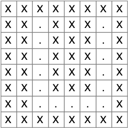
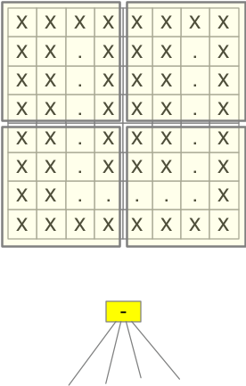
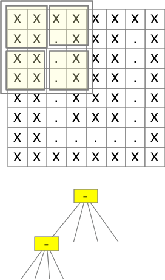
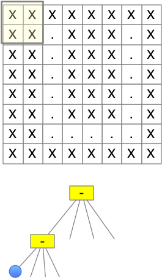
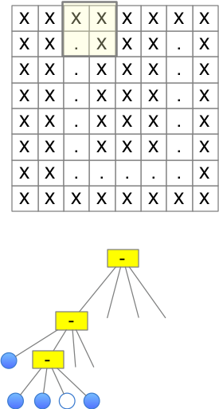
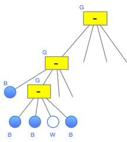

# HOWTO encode an image as a quadtree

We have seen binary trees (each internal node 
having two children) and n-ary trees (each internal node having a 
list of children).  The internal nodes of a quadtree have four 
children. 

Quadtrees are one of several common approaches 
to _image compression_.   Quadtree encoding can also be used as 
_spatial indexes_, for example to accelerate "hit detection". 
We will consider the quadtree encoding of a monochrome (black and 
white) bitmap image. 

A practical quadtree image compressor would consume the binary 
representation of a bitmap image, and would produce another binary 
representation.  To keep it simple, we will instead compress an
"ASCII art" grid of characters, with "X" representing a black pixel 
and "." representing a white pixel.  Instead of a binary 
representation of the compressed image, we will produce (and consume)
a string in which "X" represents a block of black pixels, "." 
represents a block of white pixels, and "-" represents a mixed block.
"X" and "." correspond to leaves in the tree representation, and "-" 
corresponds to an inner node with four children. 

## The Quadtree representation 

The quadtree representation of a monochrome bitmap image is 
constructed by recursively subdividing any non-uniform regions into 
four sub-regions, with leaf nodes for uniform blocks of white or black.
Suppose we start with this simple image.  



The image is not uniform (it contains both white and black pixels, 
which we are representing as "." and "X"), so we would divide it 
into four sub-regions (quadrants).  In the tree representation, we are 
creating 
an internal node with four children, although we don't know what 
those children will be yet. 



We now apply the same procedure recursively to each quadrant.  Let's 
call them nw, ne, se, sw, by analogy to the northwest, northeast, 
southeast, and southwest quadrants of a map.  Consider the northwest 
quadrant.  It is also not uniform, so it will be represented by a 
another internal node.  



If we apply the same procedure to the north-west quadrant of the 
north-west quadrant, finally we find it is a uniform block of black. 
(I will say more later about how we recognize uniform blocks of 
black or white.)  This uniform block will be represented as a leaf 
in the quadtree. 



In the worst case, we might need a leaf node for each pixel of the 
image. 



In this way we can build a quadtree representation for the whole 
image.  If the image contains large blocks of solid black or white, 
the quadtree may be quite compact. If the image is complex, it may 
be larger than the bitmap image from which it was constructed. 

## Linearizing the quadtree

A tree is a useful structure internally, but we need some kind of 
_linear_ representation to save in a file.  By _linear_ I mean that 
it is a sequence of symbols (perhaps characters, or bytes).  

There are many ways we could represent a tree as a sequence. Since a 
quadtree is often used as a _compressed_ representation, we want to 
represent it compactly.  In a production-quality quadtree package, 
both the input image and the linear quadtree encoding would be 
represented compactly in binary (not necessarily printable 
characters), but just as we are representing the bitmap image as a 
grid of printable characters, for simplicity we will likewise use a 
sequence of printable characters (a string) as the linear 
representation. 

We have seen in an earlier project that some trees (e.g., arithmetic 
expression trees) can be represented by a post-order traversal of 
the tree.  Thus we wrote the arithmetic expression `(3 - x) * 4` as `3 
x - 4 * `.  We could do the same with a quadtree, treating internal 
nodes like we treated binary operators in expression trees, but with 
four operands instead of two.  For example, we could write a grid of 
four pixels as BBWWG, indicating it is a *G*rey tree (mixed colors) 
with four children, northwest and northeast pixels *B* and southeast 
and southwest pixels *W*hite.   However, we would not be able to 
determine until the end of the string whether the black and white 
regions were single pixels or larger blocks of our 8x8 grid.  

### Prefix representation

Instead of postfix notation, for quadtrees it will be more 
convenient to use prefix notation, in which the parent node appears 
before its children.  If we represent an 8x8 grid by GBBWW (a grey 
node with two black quadrants and two white quadrants), we will know 
when we encounter the first B that it represents a whole 4x4 
quadrant of solid black, rather than a smaller region.  We could 
build up the quadtree representation and then use it to fill a grid, 
but we could also skip the quadtree representation and fill the grid 
directly from the linear representation.  

Consider again the grid above.  The first few characters of its 
linearized quadtree would be GGBGBBWB.



# Implementing QuadTree encoding and decoding 

With this understanding, we are ready to begin implementing
a function that decodes the linear form (a string) and builds
an 8x8 grid of characters, which we can also convert to a string.
We'll start with a few symbolic constants. 

```python
# Symbols in the input string
BLACK = "B"
WHITE = "W"
GREY = "G"

# Symbols in the grid and string representation of the image
BLACK_PIXEL = "X"
WHITE_PIXEL = "."
```

## Decoding the linear form

Note that neither our quadtree nor our  linear representation
includes an explicit representation of the size of the region 
represented by each node.  If we know the size of the grid 
represented by the whole quadtree, we can infer the size of the 
region represented by each node.  

We can write a recursive function 
to fill a grid from a string.  (We do not need a QuadTree
class for this part.)  We'll begin by creating the 8x8 grid
to fill in.  We should replace every character in the grid, so
to make debugging easier we will start with a grid of
invalid characters that will be easy to spot if any are left
after we decode the linear representation. 

```python
def fresh_grid() -> list[list[str]]:
    """A fresh 8x8 grid, filled initially with an invalid character"""
    grid = []
    for row in range(8):
        grid.append(["@"] * 8)
    return grid
```

We can also write a helper function to fill a block with a single 
color (character):

```python
def fill_region(grid: list[list[str]], 
                row_l: int, col_l: int, 
                size: int, fill_with: str):
    """Fill grid[row_l:row_l+size][col_l:col_l+size] with fill_with"""
    for row in range(row_l, row_l+size):
        for col in range(col_l, col_l+size):
            grid[row][col] = fill_with
```

To fill the grid 
on-the-fly as we process the linear representation, we will need to 
keep track of both the region size and position of the region we are 
filling.  It will be most convenient to write an outer function that 
gets started, and an inner recursive function.  I have provided
the outer function that sets up the recursive function and
processes its result, but left the recursive function mostly to you:

```python
def decode(s: str) -> str:
    """s is a prefix encoding of a quadtree representation 
    of an 8x8 grid.  'B' represents a black quadrant (all 'X'), 'W' 
    represents a white quadrant (all '-'), and 'G' represents a grey 
    quadrant (mix of black and white).
    The returned grid is a list of 8 strings, each with 8 
    characters, all either '-' or 'X'
    """
    grid = fresh_grid()
    s_pos = 0

    def r_decode(row: int, col: int, size: int):
        """Process the next element of s"""
        nonlocal s_pos
        nonlocal grid

        command = s[s_pos]
        s_pos += 1
        # --------------------------------------
        # FIXME: You do something with "command"
        # --------------------------------------

    r_decode(0, 0, 8)  # Start with the whole 8x8 grid
    return "\n".join(["".join(row) for row in grid])
```

Here is a test case: 
```python
linear_1 = "GGGBWBWWGBBBWWGWGWBWBWGBBWBGGBWBWWGBWBWWGWGWBWBWGWBWB"
expected = """
X......X
.X....X.
..XXXX..
...XX...
...XX...
..X..X..
.X....X.
X......X
""".strip()
assert decode(linear_1) == expected
```
Here is one more test case: 

```python
linear_2 = "GGBGBBBWGWBBWBGBGBBBWGWBBWBGBGWBBWGWBBBGWWBBGBGWBBWGWWBBB"
expected = """
XXXXXXXX
XX.XXX.X
XX.XXX.X
XX.XXX.X
XX.XXX.X
XX.XXX.X
XX.....X
XXXXXXXX
""".strip()
assert decode(linear_2) == expected
```

## Buildng a QuadTree and its linear form

While we were able to go directly from the linear representation to 
a grid of characters, without an intermediate tree representation, 
it is not so easy to go directly from a grid of characters to the 
linear representation.  We'll create a QuadTree class and subclasses 
for internal nodes (which we think of as "grey", i.e., mixed color)
and solid (white or black) nodes. 

```python
class QuadTree:
    """A quadtree representation of a monochrome image.
    Restriction:  Imagine is square with side a power of 2,
    to avoid dealing with "off-screen" portions of image.
    """
    pass


class Leaf(QuadTree):
    """A leaf represents a solid block. This class includes only singletons,
    which we use as constants!
    """
    def __init__(self, symbol: str):
        """symbol is the character we use in the linearized representation"""
        self.symbol = symbol

    def __str__(self) -> str:
        # The linear representation of the quadtree
        return self.symbol   
```

We don't need distinct objects for every white or black block.
Since we are not keeping the size or position of the block in the
object, we can have just a single representative of white blocks
and a single representative of black blocks.  This will simplify
comparisons.

```python
BLACK_NODE = Leaf(BLACK)  # Just one black node, so we can compare with "is"
WHITE_NODE = Leaf(WHITE)  # Just one white node, so we can compare with "is"
```

Grey (mixed color) blocks are internal nodes in the tree 
representation.  

```python
class GreyNode(QuadTree):
    def __init__(self, nw: QuadTree, ne: QuadTree, se: QuadTree, sw: QuadTree):
        self.nw = nw  # Northwest quadrant
        self.ne = ne  # Northeast quadrant
        self.se = se  # Southeast quadrant
        self.sw = sw  # Southwest quadrant
       

    def __str__(self) -> str:
        # Linear representation of the QuadTree
        return "G" + str(self.nw) + str(self.ne) + str(self.se) + str(self.sw)
```

Note how easy it is to turn the tree into its linear representation
with the `str` function. 

What remains, though, is to create the QuadTree representation from
a grid or its character graphic.  We'll write a separate function 
that takes the multi-line character graphic and produces an 8x8 list 
of lists of one character strings: 

```python
def str_to_grid(s: str) -> list[list[str]]:
    """Convert 8 lines of 8 characters, separated by newline
    into 8x8 matrix of characters.
    """
    lines = s.strip().splitlines() # Ignore beginning or ending newline, for convenience
    assert len(lines) == 8, "Wrong number of lines, should be 8"
    for line in lines:
        assert len(line) == 8, "Line length wrong, should be 8"
    grid = [[ch for ch in line] for line in lines]
    return grid
```

The (recursive) function build_quad_tree takes a grid and returns
a quadtree structure.  I will leave this mostly to you. There are 
three main cases to consider: 

- If the size of the region to be represented is of size one, it 
  should return either the BLACK leaf or the WHITE leaf.

Otherwise we need to find the quadtree representation of all four 
subregions. 

- If all four children are the same Leaf node (WHITE or BLACK),
  we will just return that Leaf node. 
- Otherwise, we will create a GreyNode with the four children. 


```python
def build_quad_tree(grid: list[list[str]], row_l: int, col_l: int, size: int) -> QuadTree:
    """Return quadtree representation of grid[row_l:row_l+size][col_l:col_l+size]"""
    return BLACK_NODE # FIXME
```

It is easiest to test `build_quad_tree` by checking the linear 
representation of the tree it builds. 

```python
sample = """
XXXXXXXX
XX.XXX.X
XX.XXX.X
XX.XXX.X
XX.XXX.X
XX.XXX.X
XX.....X
XXXXXXXX
"""
g = (str_to_grid(sample))
t = build_quad_tree(g, 0, 0, 8)
s = str(t)
assert s == "GGBGBBBWGWBBWBGBGBBBWGWBBWBGBGWBBWGWBBBGWWBBGBGWBBWGWWBBB"

sample="""
X......X
.X....X.
..XXXX..
...XX...
...XX...
..X..X..
.X....X.
X......X
""".strip()
g = (str_to_grid(sample))
t = build_quad_tree(g, 0, 0, 8)
s = str(t)
assert s == "GGGBWBWWGBBBWWGWGWBWBWGBBWBGGBWBWWGBWBWWGWGWBWBWGWBWB"
```

